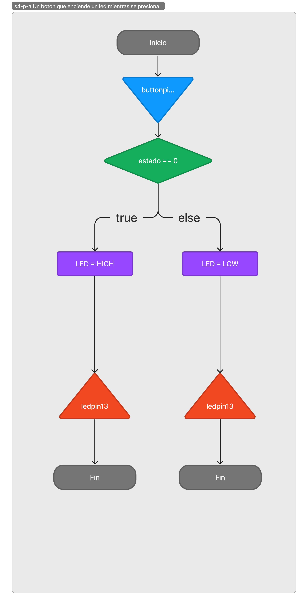

# Árboles de decisión

Clase: 04
Fecha: September 1, 2023
Unidad: U1 Fundamentos de Tecnologías Interactivas y Computación Física
Aprendizajes Esperados: i Explicar las relaciones entre las personas, las máquinas, y los artefactos analógico/digitales así como aplicar principios de programación estructuras de control y manejo de sensores y actuadores.
Descripción de actividades: Los estudiantes incorporan lógicas de estructuras de flujo como herramienta de diseño de interacción, realizan prototipos incrementales de uso de entradas y salidas digitales resultado en la creación de patrones
Evaluación: Sumativa
Nota Porcentaje : 15
Actividad: workshop
Objetivo: Desarrollar el proceso de diseño de algoritmos para la interacción humano-computadora por medio de texto-imagen-código entendiendo las tres como formas paralelas de representación. 
Duplas de estudiantes configurarán una estación de trabajo que pueda ser registrada por video, en la que irán desarrollando cuatro versiones de un árbol de decisión para posteriormente generar dos trabajos nuevos.
Cada árbol tendrá su versión en texto por medio de una declaración en español del algoritmor, una imagen del diagrama de flujo del algoritmo, y el código en lenguaje de Arduino para la posterior compilación y ejecución en la tarjeta Arduino 101 junto con botones y leds conectados por cables en un protoboard.

Previo a la clase: Comentarios de las entregas

---

**Tabla de contenidos**

10:15 → 10:30 configuración
10:30 → 11:00 artefactos
11:10 → 11:50 INPUT
12:10 → 12:50 OUTPUT

# Configuración de trabajo
15 minutos

Con el objetivo de documentar el espacio que ocupa la práctica del diseño y la posibilidad de medir el impacto de la producción, se plantea el siguiente registro multimedia: “dos columnas de artefactos adheridos con masking tape alineados en fusión de la cámara junto con la posición del micrófono”. Se grabará un minuto en intervalos de treinta minutos aproximadamente.


distribución de artefactos en la sala

# ~~Presentación de los artefactos~~

~~30 minutos 3 tomas~~

~~Las duplas ejecutarán los programas realizaron anteriormente y luego tendrán que dejar sus artefactos corriendo con el archivo blink.ino y un led en el protoboard conectado al puerto del archivo.~~

# Presentación del objetivo de la clase

Desarrollar el proceso de diseño de algoritmos para la interacción humano-computadora por medio de texto-imagen-código entendiendo las tres como formas paralelas de representación.

Duplas de estudiantes configurarán una estación de trabajo que pueda ser registrada por video, en la que irán desarrollando tres versiones de un árbol de decisión para posteriormente generar dos trabajos nuevos.

Cada árbol tendrá su versión en:

1. Texto por medio de una declaración en español del algoritmo. 
    
    Esta estará escrita en bloque de comentario en el archivo de la semana junto con los números de las duplas de manera ascendente y la letra de entrega `semana04-0508a.ino`
    
2. Imagen del diagrama de flujo del algoritmo.
    
    Formato digital libre.
    
3. Código en lenguaje de Arduino.
    
    Para la posterior compilación y ejecución en la tarjeta Arduino 101 junto con botones y leds conectados por cables en un protoboard.
    

Cada entrega se generará a medida que se termine por medio de canvas.

## Rúbrica de evaluación

**Rúbrica: Árboles de desición**

| Criterio | Nivel 1 (Insuficiente) | Nivel 2 (Básico) | Nivel 3 (Competente) | Nivel 4 (Avanzado) |
| --- | --- | --- | --- | --- |
| Comprehensión Conceptual | La comprensión de las formas de representación paralelas (texto, imagen, código) es limitada y confusa. No se demuestra comprensión de la relación entre ellas. | La comprensión de las formas de representación paralelas es parcial. Se muestran algunos vínculos entre ellas, pero falta profundidad en la conexión. | Se demuestra una sólida comprensión de las formas de representación paralelas y cómo interactúan. La relación entre texto, imagen y código se explica de manera clara y coherente. | La comprensión de las formas de representación es completa. Se presenta una descripción detallada de cómo se complementan mutuamente. |
| Proceso de Diseño | El proceso de diseño de los árboles de decisión es confuso y caótico. No se siguen pasos claros ni se justifican las decisiones de diseño. | El proceso de diseño de los árboles de decisión es básico y sigue pasos generales. Las decisiones de diseño son limitadas en su justificación. | El proceso de diseño de los árboles de decisión se sigue de manera ordenada y lógica. Las decisiones de diseño están bien fundamentadas y se explican claramente. | El proceso de diseño de los árboles es estructurado y metódico. Cada paso se justifica de manera lógica. |
| Calidad de Representación | Las versiones en texto, imagen y código son inconsistentes y carecen de coherencia entre sí. No se logra una representación clara de los algoritmos. | Las versiones en texto, imagen y código son adecuadas, pero pueden ser mejoradas en términos de claridad y cohesión. Existen algunas discrepancias entre las representaciones. | Las versiones en texto, imagen y código son coherentes y reflejan con precisión los árboles de decisión. La relación entre las representaciones es clara y consistente. | Las versiones en texto, imagen y código son completas. Se demuestra un claro nivel de atención al detalle y coherencia en las representaciones. |
| Desarrollo de Artefacto | La implementación en código y protoboard es incorrecta o no funcional. Los elementos no están conectados adecuadamente y no se demuestra comprensión de los conceptos técnicos. | La implementación en código y protoboard es básica y funcional, pero puede haber problemas menores en la conexión de componentes. La ejecución del algoritmo puede tener errores. | La implementación en código y protoboard es sólida y funcional. Los componentes están conectados correctamente y el algoritmo se ejecuta sin problemas significativos. | La implementación en código y protoboard es completa. Se demuestra destreza técnica y atención al detalle. |

**Nota sobre la Calificación Final:** La nota final se calculará sumando las puntuaciones obtenidas en cada criterio y su nivel correspondiente. La puntuación máxima posible es 16 (4 criterios x 4 niveles). La conversión de puntuación a calificación se realizará de acuerdo con los estándares institucionales.

# Feedback de dudas

# primera parte INPUT

Se entregan diagramas, código, y prototipo digital de las siguientes sentencias:

1. Un botón que enciende un led mientras se presiona
2. Un botón que deja encendido o apagado
3. Un botón que itera por un menu

## Un botón que enciende un led mientras se presiona



```arduino
/**
  * "Un boton que enciende un led mientras se presiona"
  * 
  * const se refiere a variables que no queremos cambiar su valor
  * De esta manera no cometeremos errores de valor entre tarjeta y código
  * 
  * INPUT_PULLUP define al boton como 
  *   LOW cuando no hace contacto estando fisicamente ABAJO
  *   HIGH cuando esta arriba estando fisicamente ARRIBA
  * estos valores son inverson en general cuando se usan otros inputs digitales
  * como conecciones entre circuitos accionados por noDedos
  */

const int buttonPin = 2;  // constante Pin del botón
const int ledPin = 13;    // constnate Pin del LED

int ledState = LOW;       // Estado actual del LED
int buttonState = 0;      // Variable para almacenar el estado del botón

void setup() {
  pinMode(buttonPin, INPUT_PULLUP); // Configurar el pin del botón como entrada 
  pinMode(ledPin, OUTPUT);   // Configurar el pin del LED como salida
}

void loop() {
  // Leer el estado actual del botón
  buttonState = digitalRead(buttonPin);

  // Comprobar si el estado del botón ha cambiado
  if (buttonState == 0) {
      digitalWrite(ledPin, HIGH);
  } else {
      digitalWrite(ledPin, LOW);
  }
}
```

[Link a prototipo](https://wokwi.com/projects/374606493004953601)

## Un botón que deja encendido o apagado


```arduino
/**
  * "Un boton que deja encendido o apagado"
  * 
  * const se refiere a variables que no queremos cambiar su valor
  * De esta manera no cometeremos errores de valor entre tarjeta y código
  * 
  * INPUT_PULLUP define al boton como 
  *   LOW cuando no hace contacto estando fisicamente ABAJO
  *   HIGH cuando esta arriba estando fisicamente ARRIBA
  * estos valores son inverson en general cuando se usan otros inputs digitales
  * como conecciones entre circuitos accionados por noDedos
  */

const int buttonPin = 2;  // Pin del botón
const int ledPin = 13;    // Pin del LED

int buttonState = 0;      // Variable para almacenar el estado del botón
int lastButtonState = 0;  // Variable para almacenar el último estado del botón
int ledState = LOW;       // Estado actual del LED

void setup() {
  pinMode(buttonPin, INPUT_PULLUP); // Configurar el pin del botón como entrada
  pinMode(ledPin, OUTPUT);   // Configurar el pin del LED como salida

  Serial.begin(9600);       // NECESITO SABER
}

void loop() {
  // Leer el estado actual del botón
  buttonState = digitalRead(buttonPin);

  // NECESITAS SABER LA NATURALEZA DE ENTRADA
  Serial.println(buttonState);

  // Comprobar si el estado del botón ha cambiado
  // 
  if (buttonState != lastButtonState) {
    if (buttonState == LOW) {
      // Cambiar el estado del LED cuando el botón es presionado
      ledState = !ledState;
      digitalWrite(ledPin, ledState);
    }
    delay(50);  // Pequeña pausa para evitar rebotes del botón
  }

  // Actualizar el último estado del botón
  lastButtonState = buttonState;
}
```

[Link a prototipo](https://wokwi.com/projects/374608296487585793)

## Un boton que itera por un menu


```arduino
/**
  * "Un boton que itera por un menu"
  * Dos secciones de código:
  *  primera sección lee y cambia valores de forma segura
  * segunda sección la estructura de los diferentes estados del menú
  */

const int buttonPin = 2; // Pin del botón
const int ledPin1 = 13;   // Primer LED
const int ledPin2 = 12;  // Segundo LED

int ledState = 0;        // Estado actual de los LEDs
int lastButtonState = HIGH; // Último estado del botón
int buttonState;         // Estado actual del botón
int counter = 0;

void setup() {
  pinMode(buttonPin, INPUT_PULLUP);
  pinMode(ledPin1, OUTPUT);
  pinMode(ledPin2, OUTPUT);

  Serial.begin(9600);
}

void loop() {
  // Leer el estado actual del botón
  int reading = digitalRead(buttonPin);
  Serial.print(counter);
  Serial.print(counter%3);
  Serial.println();
  
  // control de flujo para boton como contador
  if (reading != lastButtonState) {
    if (reading == HIGH) {
      counter++; // atajo para sumar 1 a una variable
    }
  }
  lastButtonState = reading; 
  delay(100);
  
  // iterando por valores de counter modulo 3
  if(counter%3 == 0) {
    digitalWrite(ledPin1, HIGH);
    digitalWrite(ledPin2, LOW);
  
  } else if(counter%3 == 1) {
    digitalWrite(ledPin1, LOW);
    digitalWrite(ledPin2, HIGH);

  } else if(counter%3 == 2){
    digitalWrite(ledPin1, LOW);
    digitalWrite(ledPin2, LOW);
  }
}
```

[Link a prototipo](https://wokwi.com/projects/374608352000249857)

# segunda parte OUTPUT

Los estudiantes crearon una variación de alguno de los ejemplos dados. La entrega consistió en un archivo zip con:  
1. Evidencia de diagrama propio de los ejemplos seleccionados
2. La edición del código con comentarios propios

En la sesión se grabó el uso de cada artefacto creado. 